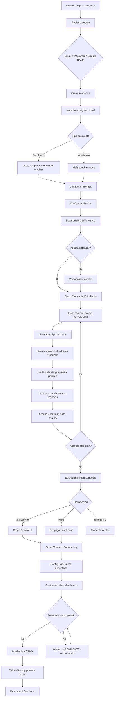
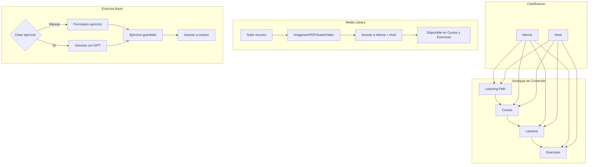
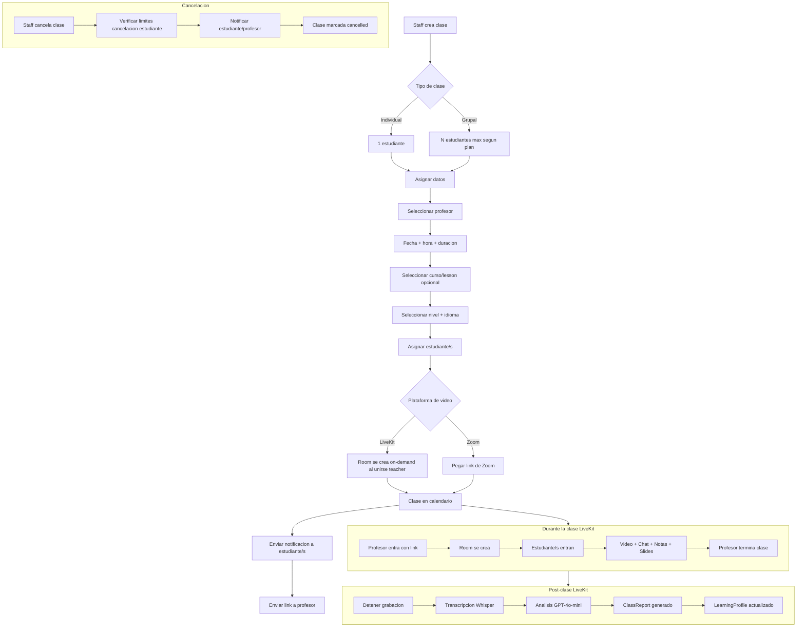
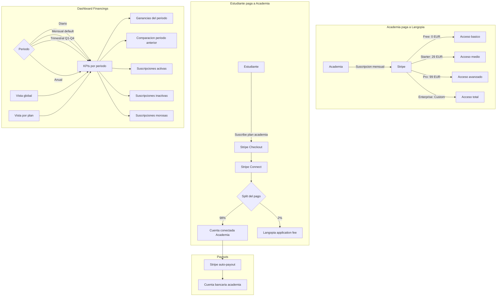
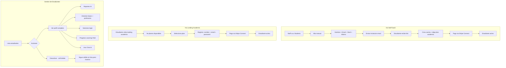
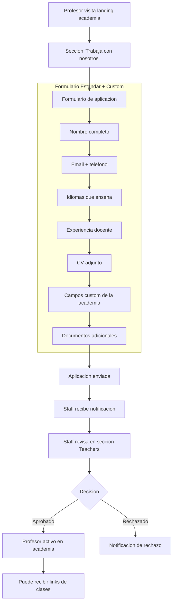
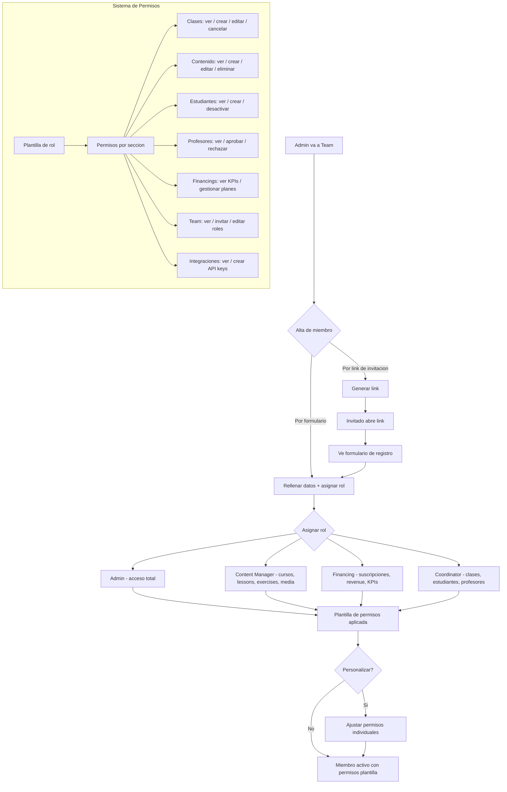
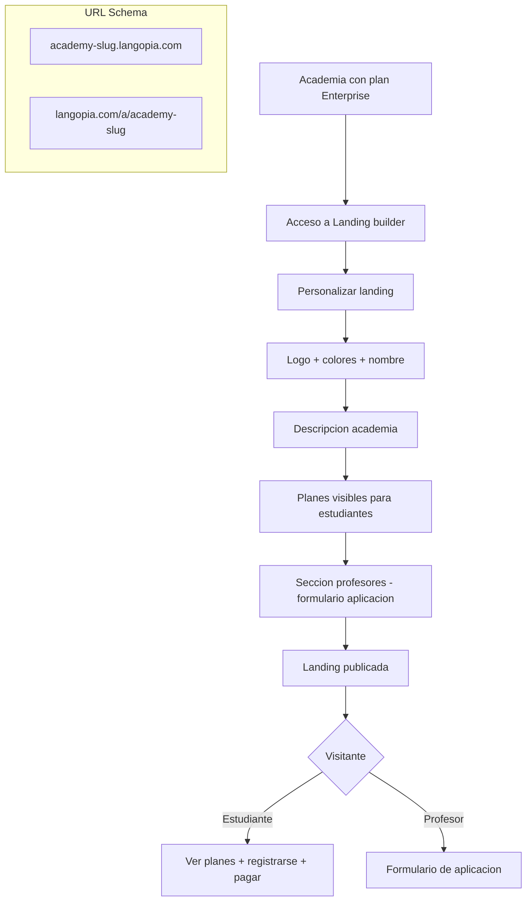
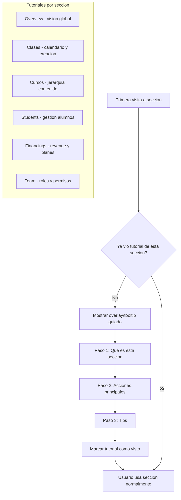

# SaaS Academy Management - Flows & Implementation Plan

**Date:** 2026-03-06
**Status:** Approved

---

## 1. Flow Diagrams

### 1.1 Onboarding - Registro de Academia



### 1.2 Gestion de Contenido



### 1.3 Gestion de Clases



### 1.4 Flujo de Pagos - Stripe Connect



### 1.5 Registro de Estudiantes



### 1.6 Aplicacion de Profesores



### 1.7 Gestion de Team (Staff)



### 1.8 Landing por Academia (Tenant)



### 1.9 Tutorial In-App (Onboarding Guide)



---

## 2. Mapa de Navegacion SaaS

```
Dashboard
|
+-- Overview (global, todas las academias)
|
+-- [Selector de Academia]
|   |
|   +-- Clases (calendario, crear/editar/cancelar)
|   +-- Cursos (CRUD, asociar lessons, filtrar idioma/nivel)
|   +-- Lessons (CRUD, asociar exercises, filtrar idioma/nivel)
|   +-- Exercise Bank (manual + IA, filtrar idioma/nivel)
|   +-- Learning Path (ordenar cursos, asignar a niveles)
|   +-- Media Library (upload, categorizar, usar en contenido)
|   +-- Students (lista, perfil completo, soft delete, alta manual)
|   +-- Teachers (lista, perfil consulta, aplicaciones, aprobar/rechazar)
|   +-- Financings (planes academia, KPIs, revenue, periodos)
|   +-- Team (staff, roles, permisos, invitaciones)
|   +-- Integraciones (API keys)
|
+-- Settings (perfil usuario, suscripcion Langopia, Stripe Connect)
```

---

## 3. Entidades Nuevas / Modificadas

### Nuevas entidades
| Entidad | Descripcion |
|---------|-------------|
| `Course` | Agrupacion de Lessons. Pertenece a Academy. Tiene idioma + nivel |
| `CourseLeson` | Relacion Course-Lesson con orden |
| `LearningPathCourse` | Relacion LearningPath-Course con orden (reemplaza LearningPathLesson) |
| `AcademyLevel` | Niveles custom por academia (ej: A1, A1.1, B2+) |
| `AcademyLanguage` | Idiomas que ensena la academia |
| `AcademyPlan` | Planes que la academia ofrece a estudiantes (nombre, precio, periodicidad, limites) |
| `StudentSubscription` | Suscripcion de estudiante a plan de academia (Stripe sub ID, status, fechas) |
| `TeacherApplication` | Formulario de aplicacion de profesor (datos + archivos + status) |
| `ApplicationCustomField` | Campos custom del formulario por academia |
| `TeamMember` | Staff de la academia (user + rol + permisos custom) |
| `RoleTemplate` | Plantilla de permisos por rol (admin, content_manager, financing, coordinator) |
| `OnboardingProgress` | Tracking de tutoriales vistos por usuario |
| `AcademyLanding` | Config de landing por academia (colores, textos, secciones activas) |

### Entidades modificadas
| Entidad | Cambio |
|---------|--------|
| `Academy` | Agregar: `stripeConnectAccountId`, `onboardingCompleted`, relacion a languages/levels |
| `Student` | Agregar: `isActive` (soft delete), relacion a `StudentSubscription` |
| `Class` | Agregar: `zoomLink` (nullable), relacion a `Course` opcional |
| `Lesson` | Agregar: FK a `AcademyLanguage`, FK a `AcademyLevel` |
| `Exercise` | Agregar: FK a `AcademyLanguage`, FK a `AcademyLevel` |
| `User` | Ya existe - se usa para staff via `TeamMember` |

### Entidades que se eliminan/reemplazan
| Entidad | Accion |
|---------|--------|
| `AcademyMember` | Reemplazada por `TeamMember` (mas granular) |
| `LearningPathLesson` | Reemplazada por `LearningPathCourse` (ahora LP -> Course -> Lesson) |

---

## 4. Actualizacion PLAN_LIMITS (Langopia SaaS)

```typescript
export const PLAN_LIMITS = {
  free: {
    maxAcademies: 1,
    maxClassesPerMonth: 10,
    maxClassHoursPerMonth: 10,
    maxReportsPerMonth: Infinity,
    maxStudentsPerRoom: 2,
    maxStorageBytes: 5_368_709_120,        // 5 GB
    maxAiTokensPerMonth: 50_000,
    maxTtsCharactersPerMonth: 10_000,
    integrations: false,
    academyLanding: false,
  },
  starter: {
    maxAcademies: 3,
    maxClassesPerMonth: 50,
    maxClassHoursPerMonth: 25,
    maxReportsPerMonth: Infinity,
    maxStudentsPerRoom: 8,
    maxStorageBytes: 10_737_418_240,       // 10 GB
    maxAiTokensPerMonth: 500_000,
    maxTtsCharactersPerMonth: 100_000,
    integrations: false,
    academyLanding: false,
  },
  professional: {
    maxAcademies: 10,
    maxClassesPerMonth: 200,
    maxClassHoursPerMonth: 100,
    maxReportsPerMonth: Infinity,
    maxStudentsPerRoom: 25,
    maxStorageBytes: 53_687_091_200,       // 50 GB
    maxAiTokensPerMonth: 2_000_000,
    maxTtsCharactersPerMonth: 500_000,
    integrations: true,
    academyLanding: false,
  },
  enterprise: {
    maxAcademies: 999,
    maxClassesPerMonth: Infinity,
    maxClassHoursPerMonth: Infinity,
    maxReportsPerMonth: Infinity,
    maxStudentsPerRoom: 50,
    maxStorageBytes: 536_870_912_000,      // 500 GB
    maxAiTokensPerMonth: Infinity,
    maxTtsCharactersPerMonth: Infinity,
    integrations: true,
    academyLanding: true,
  },
};
```

---

## 5. Sistema de Permisos - Plantillas de Rol

```typescript
enum Permission {
  // Clases
  CLASSES_VIEW, CLASSES_CREATE, CLASSES_EDIT, CLASSES_CANCEL,
  // Contenido
  COURSES_VIEW, COURSES_MANAGE,
  LESSONS_VIEW, LESSONS_MANAGE,
  EXERCISES_VIEW, EXERCISES_MANAGE,
  LEARNING_PATHS_VIEW, LEARNING_PATHS_MANAGE,
  MEDIA_VIEW, MEDIA_MANAGE,
  // Personas
  STUDENTS_VIEW, STUDENTS_CREATE, STUDENTS_DEACTIVATE,
  TEACHERS_VIEW, TEACHERS_APPROVE,
  // Financiero
  FINANCINGS_VIEW_KPIS, FINANCINGS_MANAGE_PLANS,
  // Team
  TEAM_VIEW, TEAM_INVITE, TEAM_EDIT_ROLES,
  // Integraciones
  INTEGRATIONS_VIEW, INTEGRATIONS_MANAGE,
  // Settings
  ACADEMY_SETTINGS,
}

const ROLE_TEMPLATES = {
  admin: Object.values(Permission),  // todos
  content_manager: [
    COURSES_VIEW, COURSES_MANAGE,
    LESSONS_VIEW, LESSONS_MANAGE,
    EXERCISES_VIEW, EXERCISES_MANAGE,
    LEARNING_PATHS_VIEW, LEARNING_PATHS_MANAGE,
    MEDIA_VIEW, MEDIA_MANAGE,
    CLASSES_VIEW,
  ],
  financing: [
    FINANCINGS_VIEW_KPIS, FINANCINGS_MANAGE_PLANS,
    STUDENTS_VIEW,
  ],
  coordinator: [
    CLASSES_VIEW, CLASSES_CREATE, CLASSES_EDIT, CLASSES_CANCEL,
    STUDENTS_VIEW, STUDENTS_CREATE, STUDENTS_DEACTIVATE,
    TEACHERS_VIEW, TEACHERS_APPROVE,
  ],
};
```

---

## 6. Plan de Implementacion

### Fase 1: Fundamentos (Backend)
> Entidades base, auth, permisos

| # | Tarea | Archivos principales |
|---|-------|---------------------|
| 1.1 | Crear entidades: `AcademyLevel`, `AcademyLanguage` | `apps/api/src/database/entities/` |
| 1.2 | Crear entidad `Course`, `CourseLesson` | entities + migration |
| 1.3 | Reemplazar `LearningPathLesson` por `LearningPathCourse` | entities + migration |
| 1.4 | Crear entidad `AcademyPlan` (planes para estudiantes) | entity + migration |
| 1.5 | Crear entidad `StudentSubscription` | entity + migration |
| 1.6 | Crear entidad `TeacherApplication` + `ApplicationCustomField` | entities + migration |
| 1.7 | Crear entidad `TeamMember` (reemplaza `AcademyMember`) + migration datos existentes | entity + migration |
| 1.8 | Crear entidad `RoleTemplate` + seed plantillas default | entity + migration + seed |
| 1.9 | Crear entidad `OnboardingProgress` | entity + migration |
| 1.10 | Crear entidad `AcademyLanding` | entity + migration |
| 1.11 | Actualizar `Academy`: `stripeConnectAccountId`, `onboardingCompleted` | entity + migration |
| 1.12 | Actualizar `Student`: `isActive` soft delete | entity + migration |
| 1.13 | Actualizar `Class`: `zoomLink` nullable | entity + migration |
| 1.14 | Actualizar `Lesson`, `Exercise`: FK idioma + nivel | entities + migration |
| 1.15 | Actualizar `PLAN_LIMITS` en `@langopia/shared` | `packages/shared/src/types/index.ts` |
| 1.16 | Nuevo `Permission` enum + `ROLE_TEMPLATES` en `@langopia/shared` | shared types |

### Fase 2: API Modules (Backend)
> Endpoints NestJS para cada seccion

| # | Tarea | Modulo NestJS |
|---|-------|--------------|
| 2.1 | `AcademyLevelsModule` - CRUD niveles por academia | `apps/api/src/academy-levels/` |
| 2.2 | `AcademyLanguagesModule` - CRUD idiomas por academia | `apps/api/src/academy-languages/` |
| 2.3 | `CoursesModule` - CRUD cursos, asociar lessons, filtrar por idioma/nivel | `apps/api/src/courses/` |
| 2.4 | Actualizar `LearningPathsModule` - usar Courses en vez de Lessons | `apps/api/src/learning-paths/` |
| 2.5 | `AcademyPlansModule` - CRUD planes de estudiante | `apps/api/src/academy-plans/` |
| 2.6 | `StudentSubscriptionsModule` - suscribir, cancelar, listar | `apps/api/src/student-subscriptions/` |
| 2.7 | Stripe Connect: onboarding, crear cuenta conectada, webhooks | `apps/api/src/stripe/` |
| 2.8 | `TeacherApplicationsModule` - enviar, listar, aprobar/rechazar | `apps/api/src/teacher-applications/` |
| 2.9 | `TeamModule` - CRUD staff, roles, permisos, invitaciones | `apps/api/src/team/` |
| 2.10 | `FinancingsModule` - KPIs, revenue, agrupacion por periodo | `apps/api/src/financings/` |
| 2.11 | `OnboardingModule` - tracking tutoriales vistos | `apps/api/src/onboarding/` |
| 2.12 | `AcademyLandingModule` - config landing por academia | `apps/api/src/academy-landing/` |
| 2.13 | Actualizar `ClassesModule` - soporte Zoom link | `apps/api/src/classes/` |
| 2.14 | Actualizar `StudentsModule` - soft delete, filtros idioma/nivel | `apps/api/src/students/` |
| 2.15 | Actualizar `LessonsModule` - filtros idioma/nivel | `apps/api/src/lessons/` |
| 2.16 | Actualizar `ExercisesModule` - filtros idioma/nivel | `apps/api/src/exercises/` |
| 2.17 | Actualizar `@langopia/api-client` con todos los nuevos endpoints | `packages/api-client/` |

### Fase 3: Web SaaS (Frontend)
> Dashboard pages con Soft UI / Modern Dark-Light

| # | Tarea | Ruta |
|---|-------|------|
| 3.1 | Onboarding wizard (registro academia multi-step) | `/onboarding/*` |
| 3.2 | Stripe Connect onboarding flow | `/onboarding/payouts` |
| 3.3 | Overview global (metricas cross-academia) | `/dashboard/overview` |
| 3.4 | Selector de academia (switcher en sidebar) | Layout component |
| 3.5 | Clases - calendario (crear, editar, cancelar, LiveKit/Zoom) | `/dashboard/[academyId]/classes` |
| 3.6 | Cursos - CRUD con filtros idioma/nivel | `/dashboard/[academyId]/courses` |
| 3.7 | Lessons - CRUD con filtros idioma/nivel | `/dashboard/[academyId]/lessons` |
| 3.8 | Exercise Bank - manual + IA, filtros | `/dashboard/[academyId]/exercises` |
| 3.9 | Learning Path - builder con cursos | `/dashboard/[academyId]/learning-paths` |
| 3.10 | Media Library | `/dashboard/[academyId]/media` |
| 3.11 | Students - lista, perfil completo, soft delete | `/dashboard/[academyId]/students` |
| 3.12 | Teachers - lista, perfiles, aplicaciones, aprobar/rechazar | `/dashboard/[academyId]/teachers` |
| 3.13 | Financings - planes, KPIs, revenue, graficas | `/dashboard/[academyId]/financings` |
| 3.14 | Team - staff, roles, permisos, invitaciones | `/dashboard/[academyId]/team` |
| 3.15 | Integraciones - API keys | `/dashboard/[academyId]/integrations` |
| 3.16 | Tutorial in-app system (tooltips/overlays por seccion) | Componente global |
| 3.17 | Settings (perfil, suscripcion Langopia) | `/dashboard/settings` |

### Fase 4: Landing por Academia
> Tenant-based landing para Enterprise

| # | Tarea |
|---|-------|
| 4.1 | Ruta dinamica para landing de academia: `[slug].langopia.com` o `/a/[slug]` |
| 4.2 | Pagina publica: info academia, planes estudiante, registro + pago |
| 4.3 | Seccion profesor: formulario de aplicacion |
| 4.4 | Personalizar: logo, colores, textos desde el SaaS |

### Fase 5: Graficas y Metricas
> Charts modernos para Overview y Financings

| # | Tarea |
|---|-------|
| 5.1 | Seleccionar libreria de charts (Recharts o Tremor) |
| 5.2 | Overview: clases del mes, estudiantes activos, revenue, horas de clase |
| 5.3 | Financings: revenue chart, comparacion periodos, breakdown por plan |
| 5.4 | Students: progreso learning path chart, actividad |
| 5.5 | Teachers: horas, valoraciones, distribucion alumnos |

---

## 7. Orden de Ejecucion Recomendado

```
Fase 1 (Entidades + Shared)
    |
    v
Fase 2 (API Modules)
    |
    +-------+-------+
    |       |       |
    v       v       v
  Fase 3  Fase 4  Fase 5
  (Web)  (Landing) (Charts)
```

Fases 3, 4 y 5 pueden ejecutarse en paralelo una vez Fase 2 este completa.
Dentro de Fase 3, el onboarding wizard (3.1-3.2) es prioritario ya que desbloquea el uso de todo lo demas.
